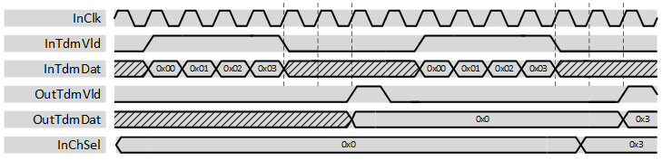

***
# psi_common_tdm_mux

- VHDL source: [psi_common_tdm_mux.vhd](../../hdl/psi_common_tdm_mux.vhd)
- Testbench: [psi_common_tdm_mux_tb.vhd](../../testbench/psi_common_tdm_mux_tb/psi_common_tdm_mux_tb.vhd)

### Description

This component allows selecting one unique channel over a bunch of "N" time division multiplexed (tdm) data. The output comes with a strobe/valid signal at the falling edge of the "tdm" strobe/valid input with a two clock cycles latency.

### Generics
Generics            | Description
--------------------|-------------------------
**rst\_pol\_g** 		| reset polarity selection
**num\_channel\_g** | Number of channels
**data\_length\_g** | Width of the data signals

### Interfaces

Signal                 |Direction  |Width                      |Description
-----------------------|-----------|---------------------------|-------------------------------------------------------------
InClk                  |Input      |1                          |Clock
InRst                  |Input      |1                          |Reset
InChSel                |Input      |Log2ceil(num\_channel\_g)  |Mux select
InTdmVld               |Input      |1                          |Strobe/valid input signal
InTdmDat               |Input      |data\_length\_g            |Data input
OutTdmVld              |Output     |1                          |AXI-S handshaking signal
OutTdmDat              |Output     |data\_length\_g            |Data output

***
[Index](../psi_common_index.md) **|** Previous: [TDM hanlding > tdm par cfg](../ch8_tdm_handling/ch8_3_tdm_par.md) **|** Next: [TDM hanlding > par tdm cfg](../ch8_tdm_handling/ch8_5_par_tdm_cfg.md)
